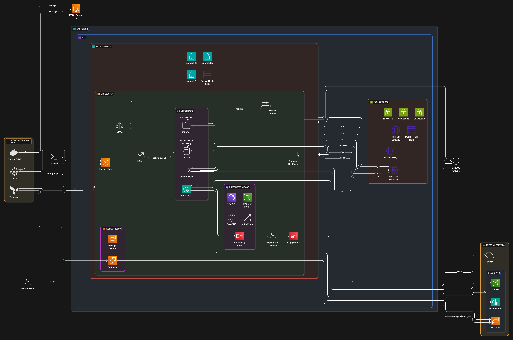

# MCP Servers on EKS

Deploy Model Context Protocol servers to Amazon EKS with Terraform and Helm for production-ready AI integration.

## Architecture Overview



- **EKS 1.33** cluster in us-west-2 with managed node groups
- **Karpenter** for intelligent node autoscaling
- **KEDA** for workload-based pod autoscaling
- **VPC** with 3 AZs, public/private subnets, NAT Gateway
- **Pod Identity** for secure AWS service access
- **LoadBalancer** services for external connectivity

## Prerequisites

### Required Tools
```bash
# Install required CLI tools
brew install terraform kubectl helm awscli docker

# Verify versions
terraform --version  # >= 1.0
kubectl version --client  # >= 1.28
helm version  # >= 3.12
aws --version  # >= 2.0
```

### AWS Setup
```bash
# Configure AWS credentials
aws configure
# Enter: Access Key ID, Secret Access Key, us-west-2, json

# Verify access
aws sts get-caller-identity

# Request Bedrock model access (for AWS MCP server)
# Go to: AWS Console → Bedrock → Model access → Request access to:
# - Amazon Titan Text G1 - Lite
# - Amazon Nova Micro (optional)
```

### Container Registry Setup
```bash
# Option 1: Use Amazon ECR
aws ecr get-login-password --region us-west-2 | docker login --username AWS --password-stdin <account-id>.dkr.ecr.us-west-2.amazonaws.com

# Create repositories
aws ecr create-repository --repository-name aws-mcp --region us-west-2
aws ecr create-repository --repository-name database-mcp --region us-west-2
aws ecr create-repository --repository-name custom-mcp --region us-west-2
aws ecr create-repository --repository-name filesystem-mcp --region us-west-2
aws ecr create-repository --repository-name mcp-frontend --region us-west-2

# Option 2: Use Docker Hub (update build.sh with your username)
```

## Step-by-Step Deployment

### Step 1: Prepare Container Images

```bash
# Clone and prepare source code
git clone <your-repo>
cd mcp-eks

# Update registry in build.sh
# Edit build.sh and replace "your-registry" with:
# - ECR: <account-id>.dkr.ecr.us-west-2.amazonaws.com
# - Docker Hub: <your-dockerhub-username>

# Build and push images
./build.sh

# Verify images are pushed
docker images | grep mcp
```

### Step 2: Update Helm Configuration

```bash
# Edit helm/mcp-servers/values.yaml
# Update image repositories to match your registry:
servers:
  aws:
    image: <your-registry>/aws-mcp:latest
  database:
    image: <your-registry>/database-mcp:latest
  custom:
    image: <your-registry>/custom-mcp:latest
  filesystem:
    image: <your-registry>/filesystem-mcp:latest
  frontend:
    image: <your-registry>/mcp-frontend:latest
```

### Step 3: Deploy Infrastructure

```bash
# Navigate to terraform directory
cd terraform

# Initialize Terraform
terraform init

# Review planned changes
terraform plan

# Deploy infrastructure (takes 15-20 minutes)
terraform apply
# Type 'yes' when prompted

# Verify cluster is ready
aws eks update-kubeconfig --region us-west-2 --name mcp-eks-cluster
kubectl get nodes
```

### Step 4: Deploy Applications

```bash
# Navigate to helm directory
cd ../helm

# Deploy MCP servers
helm install mcp-servers ./mcp-servers

# Wait for pods to be ready (2-3 minutes)
kubectl get pods -w

# Get LoadBalancer URLs
kubectl get services
```

### Step 5: Verify Deployment

```bash
# Check all components
kubectl get pods,services,hpa

# Verify Karpenter is running
kubectl get pods -n karpenter

# Verify KEDA is running
kubectl get pods -n keda-system

# Check pod identity association
kubectl describe pod <aws-mcp-pod-name>
```

## Demo Walkthrough

### Access the Frontend

```bash
# Get frontend URL
kubectl get service mcp-frontend-service
# Note the EXTERNAL-IP

# Open in browser
open http://<EXTERNAL-IP>
```

### Demo Script (15 minutes)

#### 1. AWS MCP Server Demo (5 minutes)

**Show AWS Integration:**
```
1. Click "List S3 Buckets" → Shows your S3 buckets
2. Click "Get AWS Regions" → Lists all AWS regions
3. Click "Check Free Tier" → Shows usage simulation
4. Enter prompt: "Explain Kubernetes in 50 words"
5. Click "Invoke Bedrock" → Shows AI response
```

**Explain:** "This demonstrates secure AWS service integration using Pod Identity. The MCP server can access Bedrock AI, S3 storage, and other AWS services without storing credentials."

#### 2. Database MCP Server Demo (3 minutes)

**Show Database Operations:**
```
1. Click "Get Schema" → Shows SQLite table structure
2. Try query: "SELECT * FROM users" → Shows sample users
3. Try query: "SELECT name, email FROM users WHERE id = 1"
4. Try query: "SELECT COUNT(*) as total_projects FROM projects"
```

**Explain:** "This shows how MCP servers can provide safe database access with parameterized queries and schema introspection."

#### 3. Custom MCP Server Demo (4 minutes)

**Show External API Integration:**
```
1. Enter city: "San Francisco" → Click "Get Weather"
2. Click "Generate Timestamp" → Shows multiple time formats
3. Store data: Key="demo", Value="EKS is awesome" → Click "Store Data"
4. Retrieve: Key="demo" → Shows stored value
```

**Explain:** "This demonstrates how to build custom MCP servers that integrate with external APIs and provide stateful operations."

#### 4. Filesystem MCP Server Demo (2 minutes)

**Show File Operations:**
```
1. Path: "/app" → Click "List Directory" → Shows container filesystem
2. Try path: "/tmp" → Shows temporary directory contents
```

**Explain:** "This provides secure file system access with path restrictions for safety."

#### 5. Kubernetes Features Demo (1 minute)

**Show Scaling and Management:**
```bash
# In terminal, show autoscaling
kubectl get hpa

# Show Karpenter nodes
kubectl get nodes -l karpenter.sh/provisioner-name

# Show pod distribution
kubectl get pods -o wide
```

**Explain:** "The platform automatically scales based on demand using KEDA for pods and Karpenter for nodes."

### Troubleshooting Common Issues

#### Pods Not Starting
```bash
# Check pod status
kubectl describe pod <pod-name>

# Check logs
kubectl logs <pod-name>

# Common fixes:
# 1. Image pull errors → Verify registry access
# 2. Health check failures → Check /health endpoints
# 3. Resource limits → Increase in values.yaml
```

#### LoadBalancer Pending
```bash
# Check AWS Load Balancer Controller
kubectl get pods -n kube-system | grep aws-load-balancer

# Verify subnet tags
aws ec2 describe-subnets --filters "Name=tag:kubernetes.io/role/elb,Values=1"
```

#### Bedrock Access Denied
```bash
# Verify model access in AWS Console
# Bedrock → Model access → Check approved models

# Check pod identity
kubectl describe pod <aws-mcp-pod> | grep "AWS_ROLE_ARN"
```

## Cost Management

### 2-Hour Demo Cost: ~$0.39
- EKS Control Plane: $0.20
- 2x t3.medium nodes: $0.17
- LoadBalancer + data: $0.02

### Cost Optimization
```bash
# Use smaller instances
# Edit terraform/eks.tf:
instance_types = ["t3.small"]

# Reduce to single AZ for demo
# Edit terraform/vpc.tf:
azs = slice(data.aws_availability_zones.available.names, 0, 1)
```

### Cleanup After Demo
```bash
# Delete applications
helm uninstall mcp-servers

# Delete infrastructure
cd terraform
terraform destroy
# Type 'yes' when prompted

# Verify cleanup
aws eks list-clusters --region us-west-2
```

## Production Considerations

### Security Enhancements
- Replace wildcard IAM permissions with specific resources
- Use specific image tags instead of `latest`
- Enable EKS audit logging
- Implement network policies

### Monitoring & Observability
- Add Prometheus/Grafana for metrics
- Implement distributed tracing
- Set up log aggregation
- Configure alerting rules

### High Availability
- Multi-region deployment
- Database replication
- Circuit breakers for external APIs
- Backup and disaster recovery

## Architecture Decisions

### Why EKS?
- Managed Kubernetes with AWS integration
- Automatic updates and security patches
- Native support for AWS services

### Why Karpenter?
- Cost-optimized node provisioning
- Faster scaling than Cluster Autoscaler
- Better bin packing and instance selection

### Why KEDA?
- Event-driven autoscaling beyond CPU/memory
- Support for 50+ scalers (SQS, Kafka, etc.)
- Fine-grained scaling control

### Why Pod Identity?
- More secure than IRSA for application workloads
- Simplified credential management
- Better audit trail

## Support & Resources

- [EKS Documentation](https://docs.aws.amazon.com/eks/)
- [Karpenter Guide](https://karpenter.sh/)
- [KEDA Documentation](https://keda.sh/)
- [MCP Specification](https://spec.modelcontextprotocol.io/)
- [Troubleshooting Guide](./docs/troubleshooting.md)